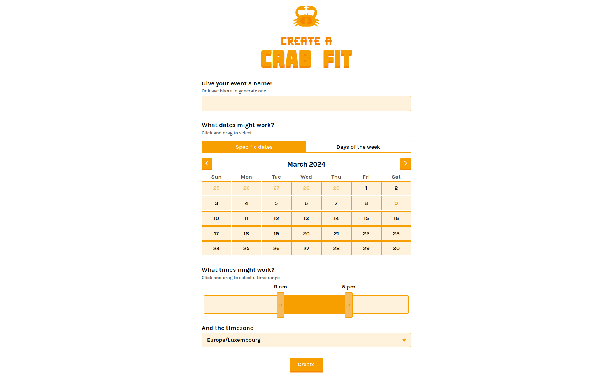

<!--
Nota bene : ce README est automatiquement généré par <https://github.com/YunoHost/apps/tree/master/tools/readme_generator>
Il NE doit PAS être modifié à la main.
-->

# Crab Fit pour YunoHost

[](https://dash.yunohost.org/appci/app/crabfit)  

[](https://install-app.yunohost.org/?app=crabfit)

*[Lire le README dans d'autres langues.](./ALL_README.md)*

> *Ce package vous permet d’installer Crab Fit rapidement et simplement sur un serveur YunoHost.*  
> *Si vous n’avez pas YunoHost, consultez [ce guide](https://yunohost.org/install) pour savoir comment l’installer et en profiter.*

## Vue d’ensemble

Crab Fit vous aide à adapter votre événement aux horaires de chacun·e.
Créez simplement un événement ci-dessus et envoyez le lien à tous les participant·e·s.
Les résultats sont mis à jour en direct et vous pourrez voir une carte thermique montrant quand tout le monde est libre.

## Fonctionnalités

- Glisser votre souris pour sélectionner un interval de temps
- Modifiable après coup à l'aide d'un mot de passe à usage unique


**Version incluse :** 1.0~ynh4

**Démo :** <https://crab.fit>

## Captures d’écran



## Documentations et ressources

- Site officiel de l’app : <https://crab.fit>
- Documentation officielle utilisateur : <https://github.com/GRA0007/crab.fit>
- Documentation officielle de l’admin : <https://github.com/GRA0007/crab.fit>
- Dépôt de code officiel de l’app : <https://github.com/GRA0007/crab.fit>
- YunoHost Store : <https://apps.yunohost.org/app/crabfit>
- Signaler un bug : <https://github.com/YunoHost-Apps/crabfit_ynh/issues>

## Informations pour les développeurs

Merci de faire vos pull request sur la [branche `testing`](https://github.com/YunoHost-Apps/crabfit_ynh/tree/testing).

Pour essayer la branche `testing`, procédez comme suit :

```bash
sudo yunohost app install https://github.com/YunoHost-Apps/crabfit_ynh/tree/testing --debug
ou
sudo yunohost app upgrade crabfit -u https://github.com/YunoHost-Apps/crabfit_ynh/tree/testing --debug
```

**Plus d’infos sur le packaging d’applications :** <https://yunohost.org/packaging_apps>
